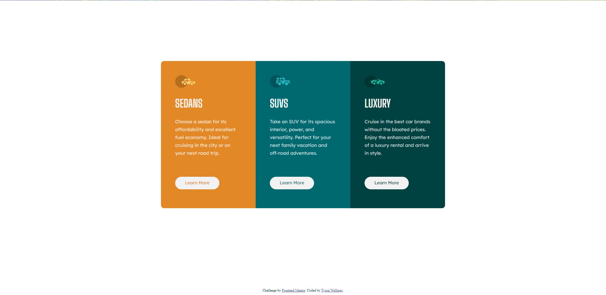
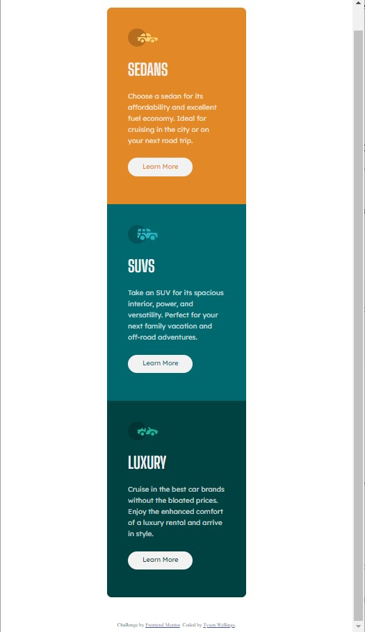

# Frontend Mentor - 3-column preview card component solution

This is a solution to the [3-column preview card component challenge on Frontend Mentor](https://www.frontendmentor.io/challenges/3column-preview-card-component-pH92eAR2-). Frontend Mentor challenges help you improve your coding skills by building realistic projects. 

# The challenge

Users should be able to:

- View the optimal layout depending on their device's screen size
- See hover states for interactive elements

# Screenshots

# Links

- Solution URL: [https://www.frontendmentor.io/challenges/3column-preview-card-component-pH92eAR2-/hub/responsive-flexbox-3-column-layout-gkmh55CLM](https://www.frontendmentor.io/challenges/3column-preview-card-component-pH92eAR2-/hub/responsive-flexbox-3-column-layout-gkmh55CLM)
- Live Site URL: [https://tyson-wellings.github.io/3-column-preview-card-component-main/](https://tyson-wellings.github.io/3-column-preview-card-component-main/)

